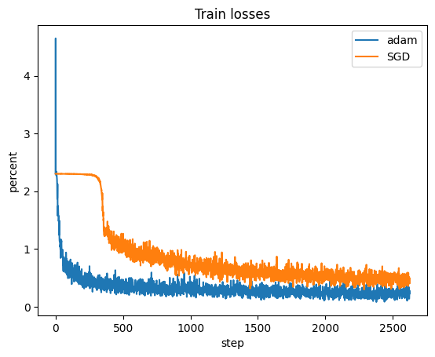
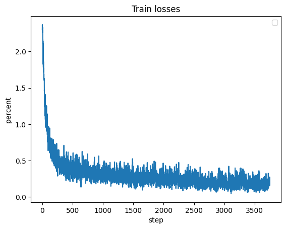
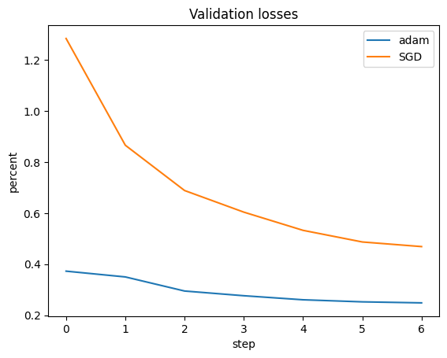
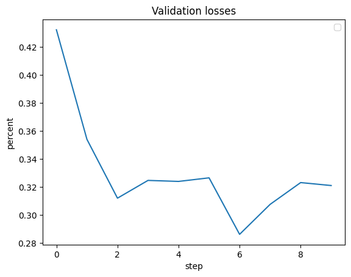
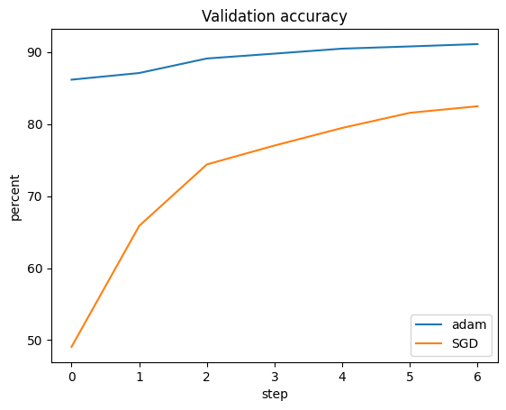
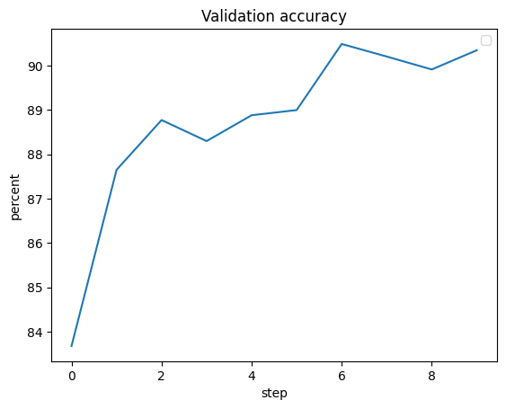
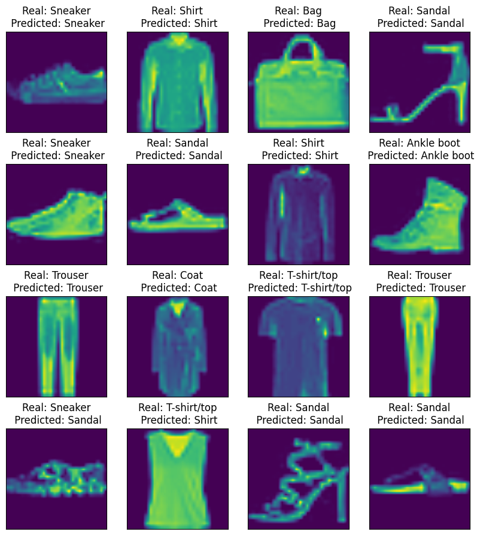

### Домашние задания по курсу
## Генерация и обработка изображений

##### Воляница Елизавета Петровна
Табельный номер: 411091

Группа: М4152

Задача: Многоклассовая классификация (распознавание предметов одежды)

Датасет: Fashion-MNIST

Классы:

- T-shirt/top
- Trouser
- Pullover
- Dress
- Coat
- Sandal
- Shirt
- Sneaker
- Bag
- Ankle boot

Архитектура: AlexNet Гипперпараметры:

- Число эпох - 10
- Число batch: 128
- Оптимизатор: Adam

Эксперимент 1. 

Предобученный на 100% данных feature extracter u-net autoencoder 

Результаты без feature extractor:

|  Class name |  Accuracy | Precision |  Recall | F1_score |
|---|---|---|---|---|
| T-shirt/top | 0.9  | 0.82720588 |  0.9 | 0.86206897 |
|  Trouser   |  0.991 | 0.97156863 | 0.991 | .98118812 |
|  Pullover   |  0.858 | 0.8755102 |  0.858 | 0.86666667 |
|  Dress   |  0.928 |  0.91790307 |  0.928  | 0.92292392 |
|  Coat   |  0.853 | 0.86248736 |   0.853  | 0.85771745 |
|  Sandal   |  0.968 |  0.99588477 |   0.968  | 0.98174442 |
|  Shirt   |  0.717 |  0.77513514 |   0.717  | 0.74493506 |
|  Sneaker   | 0.96 | 0.95238095 |   0.96  | 0.9561753 |
|  Bag   |  0.975 |  0.98385469 |   0.975  | 0.97940733 |
|  Ankle boot   | 0.972 |  0.95669291 |  0.972  | 0.96428571 |

Результаты с feature extractor на 100%:

|  Class name |  Accuracy | Precision |  Recall | F1_score |
|---|---|---|---|---|
| T-shirt/top | 0.822  | 0.86526316 |  0.822 | 0.84307692 |
|  Trouser   |  0.991 | 0.991 | 0.958 | 0.991 |
|  Pullover   |  0.827 | 0.87236287 |  0.827 | 0.84907598 |
|  Dress   |  0.919 |  0.90186457 |  0.919  | 0.91035166 |
|  Coat   |  0.879 | 0.84600577 |   0.879  | 0.86218735 |
|  Sandal   |  0.976 |  0.97893681 |   0.976  | 0.9774662 |
|  Shirt   |  0.767 |  0.73608445 |   0.767  | 0.75122429 |
|  Sneaker   | 0.952 | 0.95774648 |   0.952  | 0.95486459 |
|  Bag   |  0.986 |  0.98501499 |   0.986  | 0.98550725 |
|  Ankle boot   | 0.97 |  0.96039604 |  0.97  | 0.96517413 |

#### Графики loss и accuracy

Loss на обучающей выборке:

Loss с feature extractor 100%:

Loss на валидационной выборке:

Loss на валидационной выборке с feature extractor 100%:

Accuracy на валидационной выборке:

Accuracy на валидационной выборке с feature extractor 100%:

Пример результатов модели:

Вывод первого эксперимента: 
Модель с предобученным энкодером не дала сильно лучший результат (результат лишь немного лучше), однако кажется, что с предобученным энкодером модель обучается немного быстрее.  
