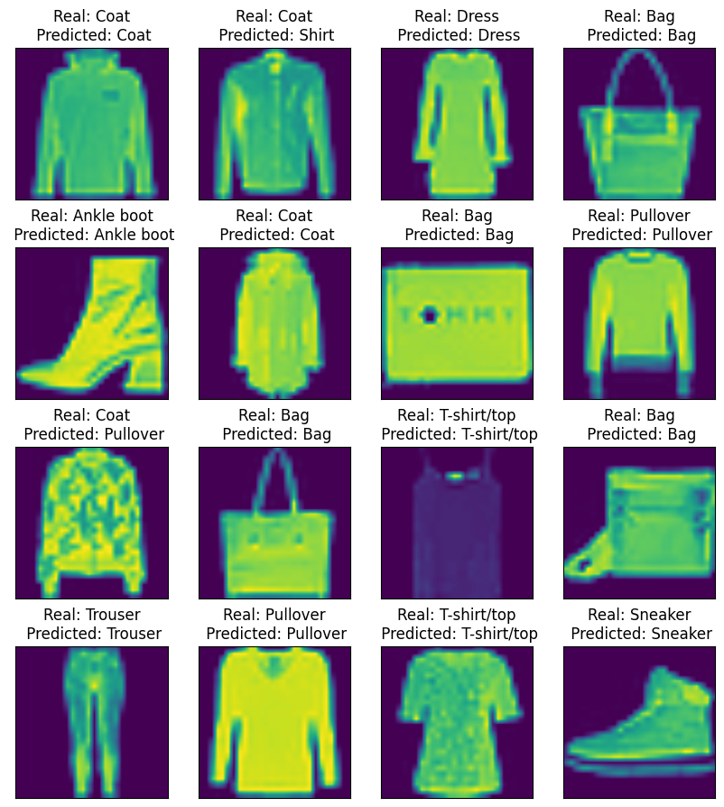

### Домашние задания по курсу
## Генерация и обработка изображений

##### Воляница Елизавета Петровна
Табельный номер: 411091

Группа: М4152

Задача: Многоклассовая классификация (распознавание предметов одежды)

Датасет: Fashion-MNIST

Классы:

- T-shirt/top
- Trouser
- Pullover
- Dress
- Coat
- Sandal
- Shirt
- Sneaker
- Bag
- Ankle boot

Архитектура: AlexNet Гипперпараметры:

- Число эпох - 7
- Число batch: 128

Оптимизаторы:

- Оптимизатор: Adam

- Оптимизатор: SGD

Результаты *Adam*:

|  Class name |  Accuracy | Precision |  Recall | F1_score |
|---|---|---|---|---|
| T-shirt/top | 0.9  | 0.82720588 |  0.9 | 0.86206897 |
|  Trouser   |  0.991 | 0.97156863 | 0.991 | .98118812 |
|  Pullover   |  0.858 | 0.8755102 |  0.858 | 0.86666667 |
|  Dress   |  0.928 |  0.91790307 |  0.928  | 0.92292392 |
|  Coat   |  0.853 | 0.86248736 |   0.853  | 0.85771745 |
|  Sandal   |  0.968 |  0.99588477 |   0.968  | 0.98174442 |
|  Shirt   |  0.717 |  0.77513514 |   0.717  | 0.74493506 |
|  Sneaker   | 0.96 | 0.95238095 |   0.96  | 0.9561753 |
|  Bag   |  0.975 |  0.98385469 |   0.975  | 0.97940733 |
|  Ankle boot   | 0.972 |  0.95669291 |  0.972  | 0.96428571 |

Результаты *SGD*:

|  Class name |  Accuracy | Precision |  Recall | F1_score |
|---|---|---|---|---|
| T-shirt/top | 0.818  | 0.7525299 |  0.818 | 0.78390034 |
|  Trouser   |  0.958 | 0.97655454 | 0.958 | .98118812 |
|  Pullover   |  0.804 | 0.62910798 |  0.804 | 0.70588235 |
|  Dress   |  0.892 |  0.81535649 |  0.892  | 0.85195798 |
|  Coat   |  0.692 | 0.74972914 |   0.692  | 0.71970879 |
|  Sandal   |  0.921 |  0.93788187 |   0.921  | 0.92936428 |
|  Shirt   |  0.385 |  0.65143824 |   0.385  | 0.48397234 |
|  Sneaker   | 0.924 | 0.88590604 |   0.924  | 0.90455213 |
|  Bag   |  0.958 |  0.93829579 |   0.958  | 0.94804552 |
|  Ankle boot   | 0.941 |  0.941 |  0.941  | 0.941 |

#### Графики loss и accuracy

Loss на обучающей выборке:

Loss на валидационной выборке:

Accuracy на валидационной выборке:

Пример результатов модели:

