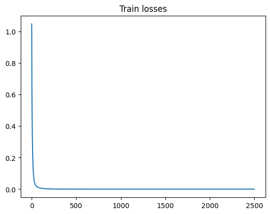
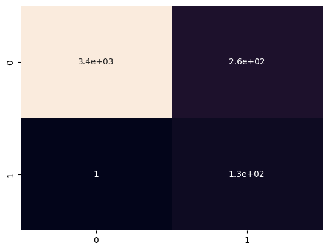

### Домашние задания по курсу
## Генерация и обработка изображений

##### Воляница Елизавета Петровна
Табельный номер: 411091

Группа: М4152

Задача: Детекция разлива металлических циллиндров

Архитектура - U-Net autoencoder

### Параметры

Оптимизатор - AdamW

Loss функция: MSE

Число эпох - 20

### Аугментация

- Resize((32, 48))

- CenterCrop((32, 32))

- RandomHorizontalFlip()

- RandomVerticalFlip()

### Метрики

True positive rate: 0.9922

True negative rate: 0.9279

Loss на обучающей выборке:

Heatmap:

